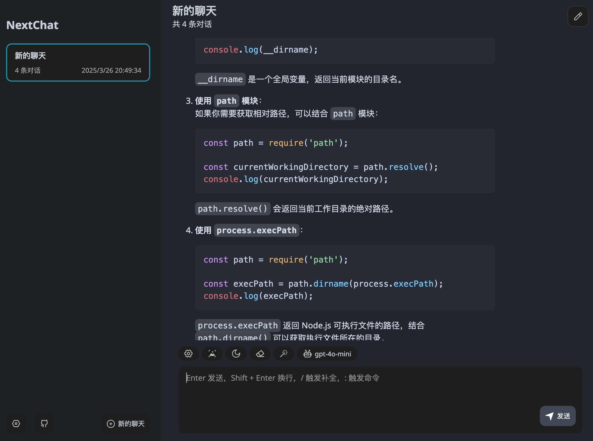
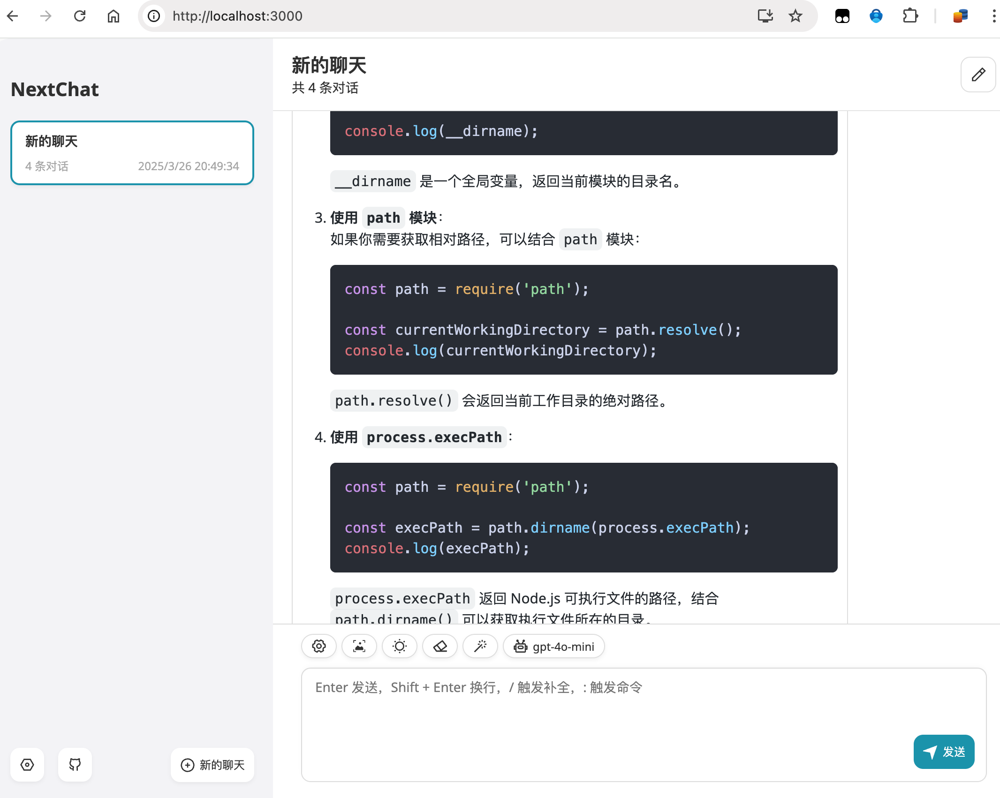

# NextChatWEB

## 快速开始

基于[NextChatWeb版](https://github.com/ChatGPTNextWeb/NextChat)进行优化, 做了以下改动:

1. 移除遥测统计
2. 美化以及精简用户界面
3. 模型列表只保留主流大模型

docker快速启动:

```
docker run -d -p 3942:3000 \
   -e OPENAI_API_KEY= \
   -e BASE_URL= \
   --name chatgpt-next-web \
   --restart=unless-stopped \
   cweijan/chatgpt-next-web
```

备注:

1. 修改对应变量的值启动, 也可直接启动, 然后进入设置自定义接口配置
2. 配置访问密码: -e CODE=your-password

## 效果预览

暗色:



亮色:


